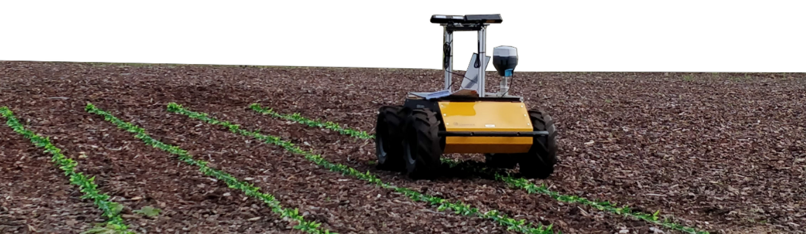
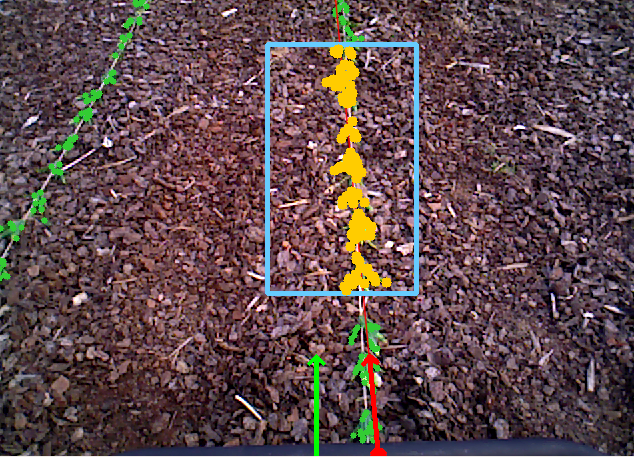
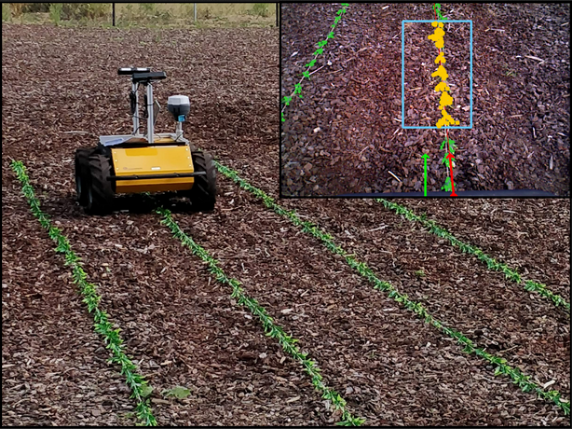

# Visual Crop Row Navigation

<div align="center">
	
</div>


**Update**

A python based implementation for Multi-crop-row navigation can be found here [visual-multi-crop-row-navigation](https://github.com/Agricultural-Robotics-Bonn/visual-multi-crop-row-navigation)

<div align="center">
	
[](https://www.youtube.com/watch?v=z2Cb2FFZ2aU)
	
</div>

This is a visual-servoing based robot navigation framework tailored for navigating in row-crop fields.
It uses the images from two on-board cameras and exploits the regular crop-row structure present in the fields for navigation, without performing explicit localization or mapping. It allows the robot to follow the crop-rows accurately and handles the switch to the next row seamlessly within the same framework.

This implementation uses C++ and ROS and has been tested in different environments both in simulation and in real world and on diverse robotic platforms.

This work has been developed @ [IPB](http://www.ipb.uni-bonn.de/), University of Bonn.

Check out the [video1](https://www.youtube.com/watch?v=uO6cgBqKBas), [video2](https://youtu.be/KkCVQAhzS4g) of our robot following this approach to navigate on a test row-crop field.

<div align="center">
	<a href="http://www.youtube.com/watch?feature=player_embedded&v=0qg6n4sshHk
		" target="_blank"></a>
	<!-- <a href="http://www.youtube.com/watch?feature=player_embedded&v=0qg6n4sshHk
		" target="_blank"></a> -->
</div>


## Features

- No maps or localization required.
- Running on embedded controllers with limit processing power (Odroid, Raspberry Pi).
- Simulation environment in Gazebo.
- Robot and cameras agnostic.

## Robotic setup

This navigation framework is designed for mobile robots equipped with two cameras mounted respectively looking to the front and to the back of the robot as illustrated in the picture below.

 <div align="center">
	
    
</div>

A complete Gazebo simulation package is provided in [agribot_robot](https://github.com/PRBonn/agribot) repository including simulated row-crop fields and robot for testing the navigation framework.

<div align="center">
	
    
</div>

## Dependencies

- c++11
- catkin
- opencv >= 2.4
- Eigen >= 3.3

## How to build and run

1. Clone the package into your *catkin_ws*
```bash
cd ~/catkin_ws/src
git clone https://github.com/PRBonn/visual_crop_row_navigation.git
```
2. Build the package
```bash
cd ~/catkin_ws
catkin build visual_crop_row_navigation
```
3. Run ROS driver to stream images from the robot's cameras, for example using [usb_cam](http://wiki.ros.org/usb_cam)
<!-- ```
* /front/rgb/image_raw [image]
* /back/rgb/image_raw [image]
``` -->
4. Run visual servoing navigation
```bash
roslaunch visual_crop_row_navigation visualservoing.launch
```

Successfully tested using:
- Ubuntu 16.04
- ROS kinetic

## Test data

Download the bagfile used for our experiments [here]().

## Simulation 

Simultion and robot packages can be found in [Agribot repo](https://github.com/PRBonn/agribot)

---

## Citation 
if you use this project in your recent works please refernce to it by:

```bash

@article{ahmadi2021towards,
  title={Towards Autonomous Crop-Agnostic Visual Navigation in Arable Fields},
  author={Ahmadi, Alireza and Halstead, Michael and McCool, Chris},
  journal={arXiv preprint arXiv:2109.11936},
  year={2021}
}

@inproceedings{ahmadi2020visual,
  title={Visual servoing-based navigation for monitoring row-crop fields},
  author={Ahmadi, Alireza and Nardi, Lorenzo and Chebrolu, Nived and Stachniss, Cyrill},
  booktitle={2020 IEEE International Conference on Robotics and Automation (ICRA)},
  pages={4920--4926},
  year={2020},
  organization={IEEE}
}

```

## Acknowledgments
This work has been supported by the German Research Foundation under Germany’s Excellence Strategy, EXC-2070 - 390732324 ([PhenoRob](http://www.phenorob.de/)) and [Bonn AgRobotics Group](http://agrobotics.uni-bonn.de/)
